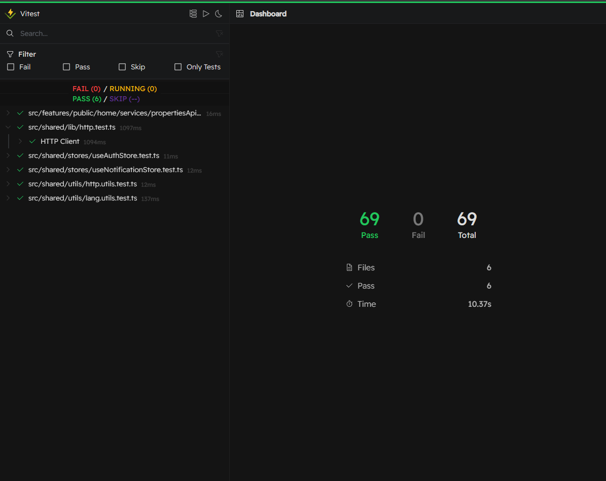

# Million Web App - Prueba Técnica

Aplicación web desarrollada con React + TypeScript + Vite para la gestión de propiedades inmobiliarias con módulos públicos y administrativos.

## 🌐 Demo en Línea

**Aplicación Principal:** [https://million-app.fabergrajales.com](https://million-app.fabergrajales.com)

**API y Documentación:** [https://million-api.fabergrajales.dev/swagger/](https://million-api.fabergrajales.dev/swagger/)

**Resultados de Pruebas Backend:** [https://million-api.fabergrajales.dev/test-results/](https://million-api.fabergrajales.dev/test-results/)

## 🔐 Credenciales de Prueba

Para acceder a los módulos administrativos (Propiedades, Usuarios, Propietarios):

```
Usuario: test@gmail.com
Contraseña: abcd1234
```

## 🚀 Características

### Módulo Público

- Visualización de propiedades disponibles
- Filtros avanzados (nombre, dirección, rango de precios)
- Modal con detalles completos de cada propiedad
- Diseño responsive y optimizado

### Módulo Administrativo

- **Gestión de Propiedades**: CRUD completo con validaciones
- **Gestión de Usuarios**: Administración de usuarios del sistema
- **Gestión de Propietarios**: Control de propietarios de inmuebles
- Sistema de autenticación con JWT
- Manejo de roles y permisos

## 🛠 Tecnologías Utilizadas

- **Frontend**: React 19, TypeScript, Vite
- **Styling**: TailwindCSS 4.1
- **Estado**: Zustand + React Query
- **Routing**: React Router v7
- **Animaciones**: Framer Motion
- **Testing**: Vitest + MSW + jsdom
- **Linting**: ESLint + TypeScript ESLint
- **Internacionalización**: i18next

## 📋 Comandos Disponibles

### Desarrollo

```bash
# Instalar dependencias
pnpm install

# Servidor de desarrollo
pnpm run dev

# Build de producción
pnpm run build

# Preview del build
pnpm run preview
```

### Testing

```bash
# Ejecutar todas las pruebas
pnpm run test

# Interfaz interactiva de pruebas
pnpm run test:ui

# Cobertura de código
pnpm run test:coverage
```

### Calidad de Código

```bash
# Verificar linting
pnpm run lint
```

## 🧪 Pruebas Frontend

### Resultados Actuales



El proyecto cuenta con **69 tests unitarios** que cubren:
- ✅ Utilidades de lenguaje y animaciones CSS
- ✅ API de propiedades y servicios HTTP
- ✅ Stores de autenticación y notificaciones
- ✅ Cliente HTTP y manejo de errores
- ✅ Utilidades HTTP y validaciones

**Total:** 6 archivos de tests | 69 tests pasando | 0 tests fallando

### Visualizar Pruebas Interactivamente

Para explorar las pruebas de forma interactiva:

```bash
pnpm run test:ui
```

Este comando abrirá una interfaz web donde podrás:

- Ver todas las pruebas organizadas por archivos
- Ejecutar pruebas individuales o en grupos
- Ver resultados en tiempo real
- Analizar cobertura de código
- Inspeccionar fallos detalladamente

## 📁 Estructura del Proyecto

```
src/
├── features/
│   ├── public/           # Módulo público (home, propiedades)
│   └── private/          # Módulos administrativos
├── shared/
│   ├── components/       # Componentes reutilizables
│   ├── stores/          # Estado global (Zustand)
│   ├── lib/             # Utilidades y configuraciones
│   └── router/          # Configuración de rutas
├── styles/              # Estilos globales (TailwindCSS)
└── test/               # Configuración y utilidades de testing
```

## 🔧 Configuración del Entorno

### Variables de Entorno

Crear un archivo `.env.local` con:

```env
VITE_BACKEND_URL=
```

### Requisitos

- Node.js 18+
- pnpm (recomendado) o npm

## 📊 Cobertura de Pruebas

El proyecto incluye **69 tests unitarios funcionales** que cubren:

- ✅ **Utilidades y Helpers**: Tests para funciones de lenguaje, animaciones CSS y validaciones HTTP
- ✅ **Servicios HTTP**: Cliente HTTP completo con manejo de errores, timeout y métodos REST
- ✅ **API de Propiedades**: Tests de construcción de URLs, filtros y parámetros de paginación
- ✅ **Gestión de Estado**: Stores de Zustand para autenticación y notificaciones
- ✅ **Flujos de Autenticación**: Login, logout, refresh de tokens y persistencia de sesión
- ✅ **Sistema de Notificaciones**: Métodos helper (success, error, warning, info) y gestión de notificaciones

**Estrategia de Testing**: Tests unitarios puros sin renderizado de componentes UI, enfocados en lógica de negocio y funciones puras.

## 🔍 Funcionalidades Destacadas

### Rendimiento

- Lazy loading de rutas y componentes
- Optimización de bundle con Vite
- Cache inteligente con React Query
- Paginación infinita en listados

### UX/UI

- Diseño responsive mobile-first
- Animaciones fluidas con Framer Motion
- Feedback visual para todas las acciones
- Manejo elegante de estados de carga y error

### Seguridad

- Validación exhaustiva en frontend y backend
- Manejo seguro de tokens JWT
- Protección de rutas privadas
- Sanitización de datos de entrada

## 👨‍💻 Desarrollo

Este proyecto fue desarrollado como una prueba técnica completa, demostrando:

- Arquitectura escalable y mantenible
- Mejores prácticas de React y TypeScript
- Testing comprehensivo
- Código limpio y bien documentado
- Configuración profesional de herramientas de desarrollo

---

**Desarrollado por:** Faber Grajales  
**Repositorio:** [million_app](https://github.com/faber1999/million_app)
